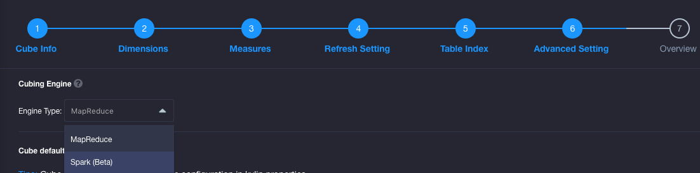
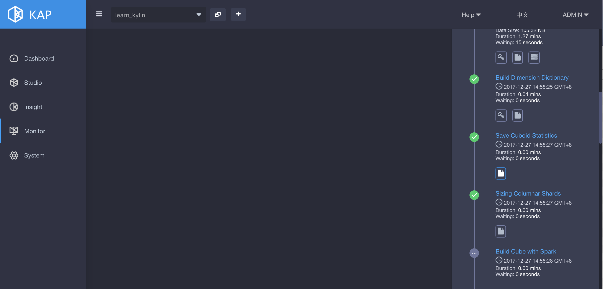

## Configure Spark Build Engine 
There are two build engines available in KAP to build a cube. They are: MapReduce and Spark. By default, KAP uses MapReduce to build a cube. But you may also switch the engine to Spark manually. In this section, we will introduce how to configure Spark build engine.

###Prerequisites

- KAP 2.5.4 or above installed. In this case, we use Hortonworks HDP 2.4 Sandbox VM.


###Prepare “kylin.env.hadoop-conf-dir”

To run Spark on Yarn, you need specify **HADOOP_CONF_DIR** environment variable, which is the directory that contains the (client side) configuration files for Hadoop. In many Hadoop distributions, the directory is “/etc/hadoop/conf”. But KAP not only needs access HDFS, Yarn and Hive, but also HBase, so the default directory might not have all necessary files. In this case, you need create a new directory and then copy or link those client files (core-site.xml, hdfs-site.xml, yarn-site.xml, hive-site.xml and hbase-site.xml) there. In HDP 2.4, there is a conflict between hive-tez and Spark, so you need change the default engine from “tez” to “mr” when copying for KAP.

```
mkdir $KYLIN_HOME/hadoop-conf
ln -s /etc/hadoop/conf/core-site.xml $KYLIN_HOME/hadoop-conf/core-site.xml 
ln -s /etc/hadoop/conf/hdfs-site.xml $KYLIN_HOME/hadoop-conf/hdfs-site.xml 
ln -s /etc/hadoop/conf/yarn-site.xml $KYLIN_HOME/hadoop-conf/yarn-site.xml 
ln -s /etc/hbase/2.4.0.0-169/0/hbase-site.xml $KYLIN_HOME/hadoop-conf/hbase-site.xml 
cp /etc/hive/2.4.0.0-169/0/hive-site.xml $KYLIN_HOME/hadoop-conf/hive-site.xml 
vi $KYLIN_HOME/hadoop-conf/hive-site.xml (change "hive.execution.engine" value from "tez" to "mr")
```

Now, let KAP know this directory with property “kylin.env.hadoop-conf-dir” in kylin.properties:

```
kylin.env.hadoop-conf-dir=/usr/local/apache-kylin-2.1.0-bin-hbase1x/hadoop-conf
```

If this property isn’t set, KAP will use the directory that “hive-site.xml” locates in; while that folder may have no “hbase-site.xml”, which will get HBase/ZK connection error in Spark.

### Check Spark configuration

KAP embeds a Spark binary in $KYLIN_HOME/spark, all the Spark configurations can be managed in $KYLIN_HOME/conf/kylin.properties with prefix *“kylin.engine.spark-conf.”*. These properties will be extracted and applied when runs submit Spark job; e.g, if you configure “kylin.engine.spark-conf.spark.executor.memory=4G”, KAP will use “–conf spark.executor.memory=4G” as parameter when you execute “spark-submit”.

Before you run Spark engine, we suggest you take a look on these configurations and do customization according to your cluster. Below is the default configuration, which is also the minimal config for a sandbox (1 executor with 1GB memory); usually in a normal cluster, you need much more executors and each has at least 4GB memory and 2 cores:

```
kylin.engine.spark-conf.spark.master=yarn
kylin.engine.spark-conf.spark.submit.deployMode=cluster
kylin.engine.spark-conf.spark.yarn.queue=default
kylin.engine.spark-conf.spark.executor.memory=1G
kylin.engine.spark-conf.spark.executor.cores=2
kylin.engine.spark-conf.spark.executor.instances=1
kylin.engine.spark-conf.spark.eventLog.enabled=true
kylin.engine.spark-conf.spark.eventLog.dir=hdfs\:///kylin/spark-history
kylin.engine.spark-conf.spark.history.fs.logDirectory=hdfs\:///kylin/spark-history

#kylin.engine.spark-conf.spark.io.compression.codec=org.apache.spark.io.SnappyCompressionCodec

## uncomment for HDP
#kylin.engine.spark-conf.spark.driver.extraJavaOptions=-Dhdp.version=current
#kylin.engine.spark-conf.spark.yarn.am.extraJavaOptions=-Dhdp.version=current
#kylin.engine.spark-conf.spark.executor.extraJavaOptions=-Dhdp.version=current
```

In order to run on Hortonworks platform, you need specify “hdp.version” as Java options for Yarn containers, so please uncomment the last three lines in kylin.properties.

Besides, in order to avoid repeatedly uploading Spark jars to Yarn, you can manually do that once, and then configure the jar’s HDFS location. Please note that the HDFS location needs be full qualified name.

```
jar cv0f spark-libs.jar -C $KYLIN_HOME/spark/jars/ .
hadoop fs -mkdir -p /kylin/spark/
hadoop fs -put spark-libs.jar /kylin/spark/
```

After then, the config in kylin.properties will be:

```
kylin.engine.spark-conf.spark.yarn.archive=hdfs://sandbox.hortonworks.com:8020/kylin/spark/spark-libs.jar
kylin.engine.spark-conf.spark.driver.extraJavaOptions=-Dhdp.version=current
kylin.engine.spark-conf.spark.yarn.am.extraJavaOptions=-Dhdp.version=current
kylin.engine.spark-conf.spark.executor.extraJavaOptions=-Dhdp.version=current
```

All the “kylin.engine.spark-conf.*” parameters can be overwritten at Cube or Project level, which gives more flexibility to user.

### Configuration Validation

After the above configurations done, we build a cube with spark in KAP to validate the configurations. In Step 6 **Advanced Setting** of cube building, choose **Spark(Beta)** as cube build engine.



 Click + behind **Cube default configuration** to add the following configurations:


And then click **Next -> Save**. Switch to Cube page and click **Build**. Click **Progress/Status** bar, you will see the cube build engine is Spark as below:

 