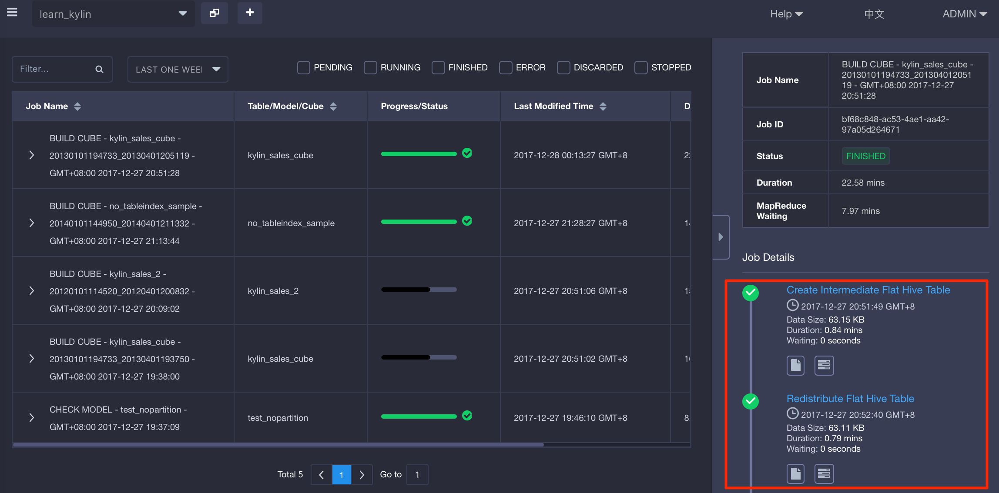

## Use SparkSQL during Cube Build

KAP leverages Hive by default to do part of the pre-calculations during cube build process. Since SparkSQL has better performance over Hive in general, using SparkSQL instead of Hive during cube build may improve the build speed at certain steps.




A running Spark Thrift server is required to enable SparkSQL during cube build. Note although technically this Spark Thrift server could be the same thrift server used for query pushdown, it is **highly recommended** **to use separate Spark Thrift servers** for query and cube build. Mixing query and build workload in one Spark Thrift server can cause unsatisfactory performance. For example, a big build job can occupy all executor resources and block pushdown queries for a long time.

Follow the steps below to enable SparkSQL during cube build.

1. As a prerequisite, prepare a Spark Thrift server that will be used during cube build.

2. Set below configuration in `conf/kylin.properties` according to your environment.

   ```properties
   kylin.source.hive.enable-sparksql-for-table-ops=true
   kylin.source.hive.sparksql-beeline-shell=/path/to/spark-client/bin/beeline
   kylin.source.hive.sparksql-beeline-params=-u jdbc:hive2://localhost:10000;principal=Spark-Kerberos-Principal
   ```

   Note for the JDBC URL, the `localhost:10000` should be replaced with the host and port of your thrift server; the `principle` parameter is only needed if security is enabled in your cluster.

3. Stop KAP and run check-env to verify the configuration.

   ```sh
   bin/kylin.sh stop
   bin/check-env.sh
   ```

   The check-env script will verify the above settings by connecting to the Spark Thrift server and attempt some SQL operations. In case of any error, try troubleshoot below command manually. It should connect to the thrift server without any error.

   ```sh
   ${kylin.source.hive.sparksql-beeline-shell} ${kylin.source.hive.sparksql-beeline-params}
   ```

4. Restart KAP to take effect.


### Other Notes

Don't confuse the SparkSQL configuration above with the Hive client settings (listed below), which is used for accessing Hive metadata, retrieving Hive table structure etc. Although seemingly similar, they are for different purposes.

```properties
# Hive client, valid value [cli, beeline]
kylin.source.hive.client=cli

# Absolute path to beeline shell, can be set to spark beeline instead of the default hive beeline on PATH
#kylin.source.hive.beeline-shell=beeline

# Parameters for beeline client, only necessary if hive client is beeline
#kylin.source.hive.beeline-params=-u jdbc:hive2://localhost:10000

```

