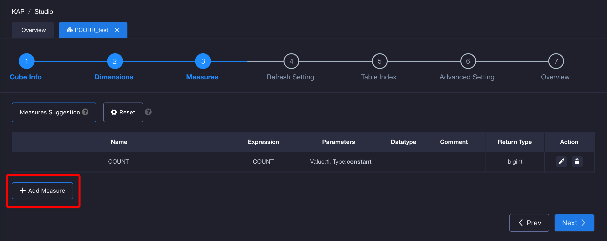
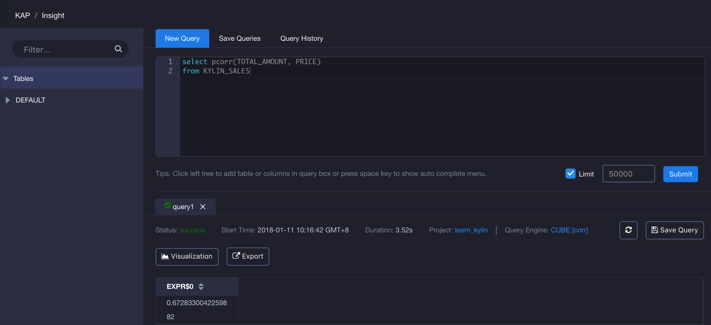

## CORR(Beta) ##

correlation confficients are used in statics to measure how strong a relationship is between two variables. In KAP V2.5.5, it supports the function Pearson's correlation, which is named *pcorr*. In this version, the  function is not supported to be used in pushdown query. Hence, please choose the measures in advance during cube build.

### CORR introduction ###

Corr function will return a value to find the relationship between the two variables. The value is between -1 and 1, where 1 indicates a strong positive relationship. For example, for every positive increase in one variable, there will be a positive increase in the aother. 0 means that there is no relationship between the two variables and -1 means that when one variable has a positive increase, the another one will have a negative decrease.  Its syntax is as below:

> pcorr({measure1},{measure2}), measure is the measure to query. It should note that, in current version, the parameter return type for function CORR must be one of  *bigint*, *integer*, *int4*, *long*, *tinyint*, *smallint* and *decimal*. If the data type of one measure is decimal , the another one also need to be decimal. Other data types which was mentioned before will not have the limitation.

The query example in KAP is as below:

```
SELECT pcorr(BUYER_ID, SELLER_ID)
FROM KYLIN_SALES
```

### How to use ###

Firstly, in the third step of Cube creation, click *Add Measure* in the left corner to add a new measure.



Secondly, input your measure name, select *PCORR* as Expression, select Param Value. The data type should be considered when you choose the measure.


Thirdly, design and build Cube, then go to *Insight* page to simulate query. You will get the result as below.


