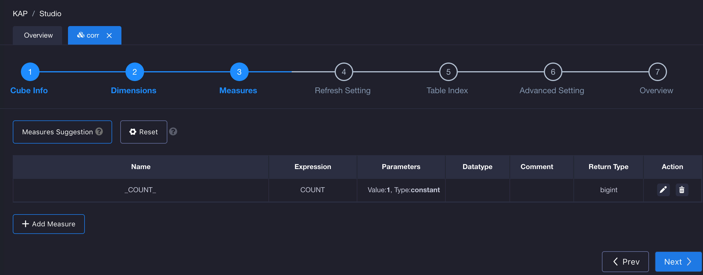
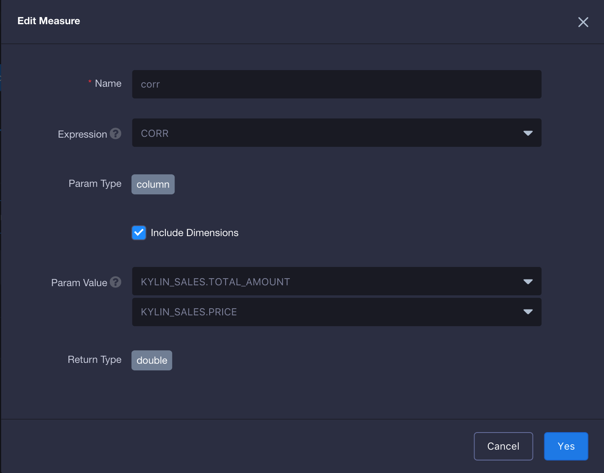

## CORR(Beta) ##

Correlation coefficient is used in statics to measure how strong a relationship is between two variables. In KAP V2.5.5, it supports the correlation coefficients function, which is named *corr*. 

### CORR Introduction ###

CORR function will return a value to find the relationship between the two variables. The value is between -1 and 1, where 1 indicates a strong positive relationship. For example, for every positive increase in one variable, there will be a positive increase in the aother variable. 0 means that there is no relationship between the two variables and -1 means that when one variable has a positive increase, another one will have a negative decrease.  Its syntax is as below:

> corr({measure1},{measure2}), measure is the column to calculate. It should note that, in the current version, the parameter return type for function CORR must be one of *real*, *bigint*, *integer*, *int4*, *long8*, *tinyint*, *smallint*, *decimal*, *double*, *float* and *numeric*. Date column is not supported to calculate now.
>
> If the data type of one column is decimal , another one also need to be decimal. Other data types which were mentioned before will not have the limitation.

The query example in KAP is as below:

```
SELECT corr(TOTAL_AMOUNT, PRICE)
FROM KYLIN_SALES
```

### How to Use ###

Step 1, in the third step of Cube creation, click *Add Measure* in the left corner to add a new measure.



Step 2, input your measure name, select *CORR* as Expression, select Param Value. The data type should be considered when you choose the measure.



Then continue to design and build Cube, and go to *Insight* page to query. You will get the result as below.


