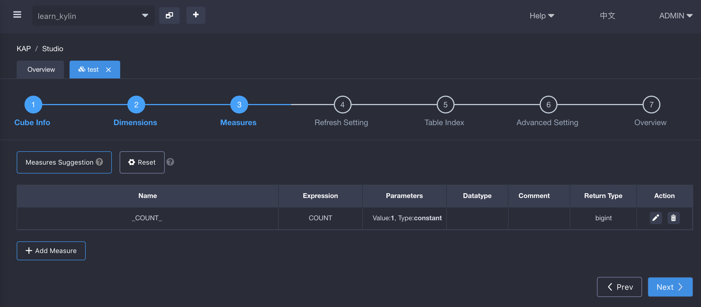
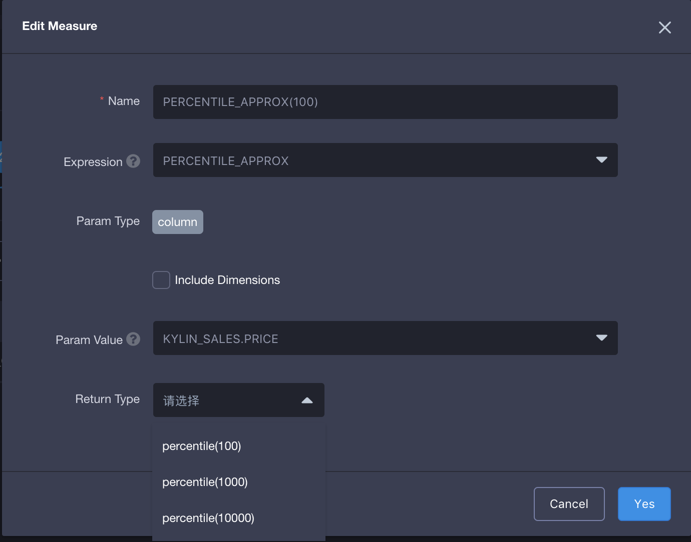
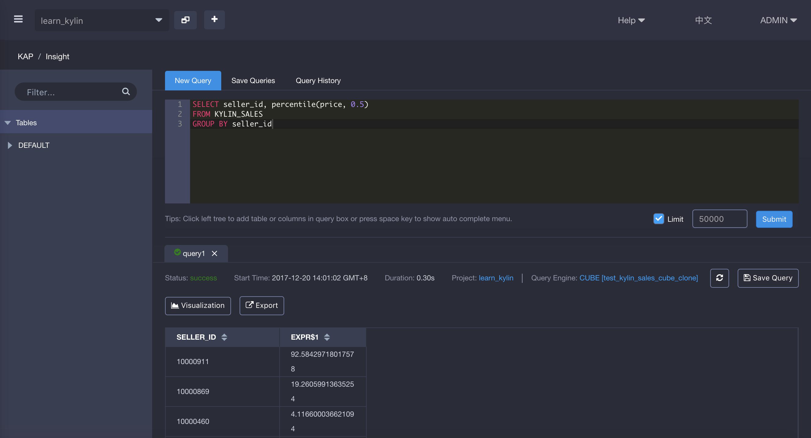

## Approximate Percentile

KAP supports the function **percentile**. Since KAP V2.5.4, it changed to **percentile_approx**. Both of them have the same algorithm and result. If you've pre-defined percentile measure, such SQL query will enable sub-second query latency. In KAP, this function has three return types: 'percentile(100)', 'percentile(1000)' and 'percentile(10000)'. The higher return value means higher accuracy and higher storage resources occupied. We recommend you use percentile(100) in general scenario.

### percentile_approx introduction

percentile_approx returns the value of below which a given percentage of observations in a group of observations fall. For example, the 20th percentile is the value below which 20% of the observations may be found. Its syntax is as below:

> percentile_approx({measure},p,B): measure is the measure to query; p is number between 0 to 1 with both included. B is to control the Approximate Accuracy. The higher the value is, the higher the accuracy of result will be. percentile_approx uses the interpolation method to determine the value of the pth percentile. 

The query example in KAP is as below:

```
SELECT seller_id, percentile_approx(price, 0.5)
FROM KYLIN_SALES
GROUP BY seller_id
```

### How to use

Firstly, in the third step of Cube creation, click **Add Measure** in the left corner to add a new measure.



Secondly, input your measure name, select **PENCENTILE_APPROX** as Expression, select Param Value, and then select return type 'percentile(100)', 'percentile(1000)' and 'percentile(10000)' on demand. The return type means B listed in the above syntax. Higher value means higher accuracy and higher storage resources occupied.



Thirdly, design and build Cube, then go to **Insight** page to simulate query. You will get the result as below.



