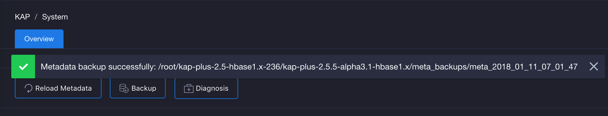
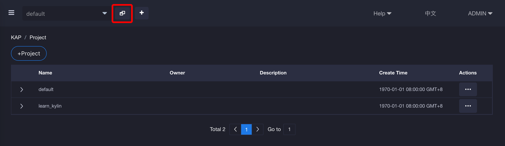
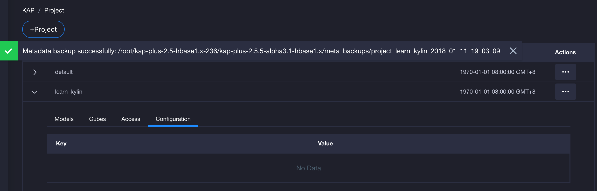
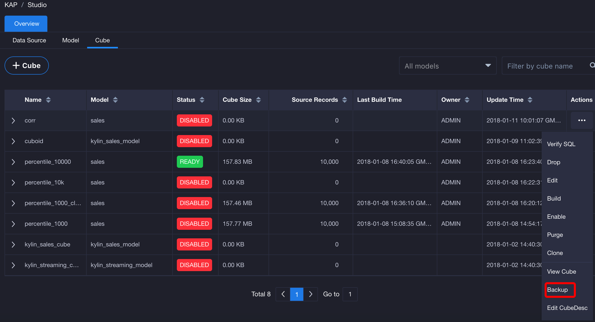
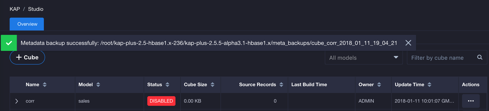

## Metadata Backup

Metadata is the most important data in KAP. Backup metadata is a regular task in daily operation. It is the only way to recover a KAP when the entire metadata is crashed causing KAP service is down due to some mishandling. In general, it is a good practice to backup metadata before each failover or system upgrade. This will ensure that the KAP service can roll back, and in the worst case still maintain the system's robustness.

KAP provides a tool for metadata backup; the usage is as follows：

```shell
$KYLIN_HOME/bin/metastore.sh backup
```
When see the following message it means a successful backup is take:

```shell
metadata store backed up to /usr/local/kylin/meta_backups/meta_2016_06_10_20_24_50
```
In the above example, this command will download all of the metadata to the local directory as local files (e.g:/usr/local/kylin/meta_backups/meta_2016_06_10_20_24_50). The directory structure is shown in the following table:

| Directory       | Description                              |
| :-------------- | :--------------------------------------- |
| project         | The basic information of the Projects    |
| model_desc      | Description of the Data Models           |
| cube_desc       | Description of the Cubes                 |
| cube            | Information of Cube Instances            |
| cube_statistics | Statistics information of Cube Instances |
| table           | Table definitions                        |
| table_exd       | Table extended information               |
| table_snapshot  | Snapshots of lookup tables               |
| dict            | Dictionary of dimension columns          |
| execute         | Cube Job definitions                     |
| execute_output  | Cube Job outputs                         |
In each directory, will see the metadata files in JSON format：
```shell
ls -l /usr/local/kylin/meta_backups/meta_2016_06_10_20_24_50/cube
-rw-r--r--. 1 root root  2550 Sep 26 07:58 kylin_sales_cube.json
-rw-r--r--. 1 root root 16602 Sep 29 08:43 tweets_cube1.json

more kylin_sales_cube.json
{
  "uuid" : "2fbca32a-a33e-4b69-83dd-0bb8b1f8c53b",
  "last_modified" : 1474876733314,
  "version" : "1.6.0",
  "name" : "kylin_sales_cube",
  "owner" : null,
  "descriptor" : "kylin_sales_cube_desc",
  "cost" : 50,
  "status" : "READY",
  "segments" : [ {
    "uuid" : "99c77a86-fd1a-44cb-ac17-f469cc055484",
    "name" : "20120101000000_20160901000000",
    "storage_location_identifier" : "KYLIN_CEFC12LOOE",
    "date_range_start" : 1325376000000,
    "date_range_end" : 1472688000000,
    "source_offset_start" : 0,
    "source_offset_end" : 0,
    "status" : "READY",
    "size_kb" : 10870,
    ....
```

In addition, metadata backup is also a tool for troubleshooting; when the system got error, the administrator can dump metadata and then check it easily.

### Metadata Backup in User Interface

Besides using the command line to backup metadata, KAP also supports to backup metadata in the user interface.

- **Instance metadata backup**

Go to the system page and click the backup button to backup instance metadata. The instance metadata will backup in the KAP installed path (e.g. /root/kap-plus-2.5-hbase1.x-236/kap-plus-2.5.5-alpha3.1-hbase1.x/meta_backups).  The name will be generated as meta_current time (e.g. meta_2018_01_11_07_01_47).



- **Project metadata backup**

Click the project list button(at the top of the page) and choose the project which needs to backup. Then unfold the action menu and click the backup button. The project metadata will backup in the KAP installed path and the name will be generated as project_project name_current time (e.g. project_learn_kylin_2018_01_11_19_03_09).





- **Cube metadata backup**

Go to the studio page and switch to Cube. Then choose one cube and unfold the action menu backup metadata. The Cube metadata will backup in the KAP installed path and the name will be generated as cube_cube name_current time (e.g. cube_corr_2018_01_11_19_04_21).




