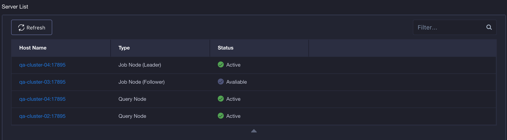

## Server Status ##

Since KAP V2.5.5, users can check the servers status among the server list in the system page, which is shown in the following figure:

### Server Type ###

* Job Node (Leader) ：The node was selected as the job engine.

* Job Node (Follower)： If the Leader node failed, the follower nodes will track the Cube build progress and process later build requests.

* Query Node： The node was selected as a query engine.

  More information could be seen in [Service Discovery and Job Engine HA](../install/adv_install_ha.en.md) and [Cluster (Load Balance) Deployment](../install/adv_install_lb.en.md)

### Server Status ###

* Active: The current nodes are running.
* Available：The current Follower nodes could be selected as the new active Leader node.

If the nodes are disconnected, it will not be shown in the server list.
