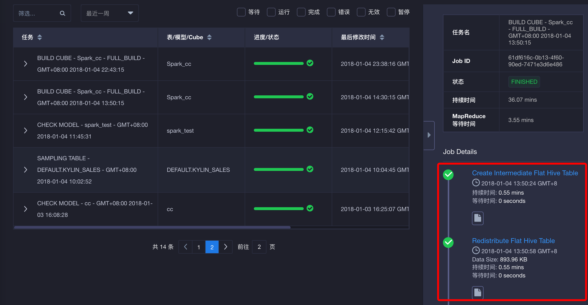

## 构建Cube过程中使用SparkSQL ##

KAP在Cube构建过程中，默认应用Hive来做部分预计算。SparkSQL在Hive上有更好的性能，所以使用Spark SQL可能会在特定步骤中提高构建速度。





在构建Cube中，使用SparkSQL需要一个运行中的Spark Thrift server。请注意，尽管这个Spark Thrift server可以同样被用于下压查询，但我们**建议**使用不同的Thrift server做查询下压和Cube构建。因为使用同一个Thrift server查询和构建时，可能导致查询和构建性能都无法令人满意。例如，一个大的构建任务可能会占用所有的executor资源，进而导致下压查询的时间被阻塞（pending）很长一段时间。

请按照下列步骤，在Cube的构建中启用SparkSQL：

1. 首先，请准备一个可以被用作Cube构建的Spark Thrift server。
2. 根据您的环境，在`conf/kylin.propertier`如下设置：

   ```  kylin.source.hive.enable-sparksql-for-table-ops=true
   kylin.source.hive.enable-sparksql-for-table-ops=true
   kylin.source.hive.sparksql-beeline-shell=/path/to/spark-client/bin/beeline
   kylin.source.hive.sparksql-beeline-params=-u jdbc:hive2://localhost:10000;principal=Spark-Kerberos-Principal
   ```

需要注意的是对于JDBC URL，`localhost:10000`需要被替换为您自己的Thrift server的地址和端口；当集群在安全模式下，会需要配置`principal`参数。

3. 关闭KAP，并运行环境检测脚本（check-env.sh）来检查相关配置是否生效。

   ```sh
   bin/kylin.sh stop
   bin/check-env.sh
   ```

   该环境检测，将会通过连接Spark Thrift server并且进行一些SQL操作来验证上面的一些设置。如果出现错误，您可以使用如下命令行来寻找故障。该命令行应该可以正常连接 Thrift server。

   ```${kylin.source.hive.sparksql-beeline-shell} ${kylin.source.hive.sparksql-beeline-params}```

4. 重启KAP后，设置应生效。

### 其他说明 ###

请不要对于一些在SprakSQL配置中关于Hive客户端的设置（将在下方列出）感到疑惑，这些设置是用来访问Hive元数据和检索Hive表结构等。尽管看起来很相似，但所用目的并不相同。

 ```
# Hive client, valid value [cli, beeline]
kylin.source.hive.client=cli

# Absolute path to beeline shell, can be set to spark beeline instead of the default hive beeline on PATH
#kylin.source.hive.beeline-shell=beeline

# Parameters for beeline client, only necessary if hive client is beeline
#kylin.source.hive.beeline-params=-u jdbc:hive2://localhost:10000
 ```
