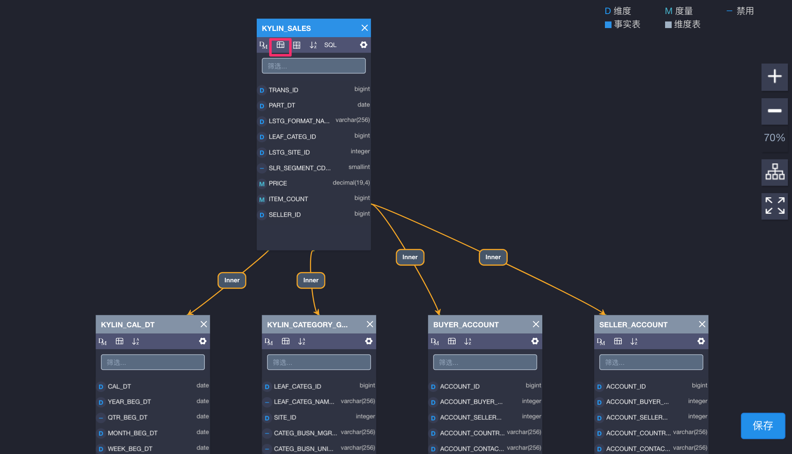
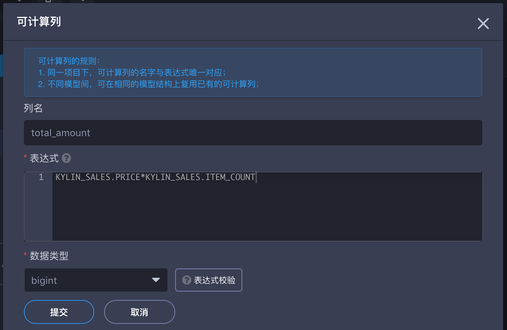

## 可计算列 (Computed Column)

**可计算列**支持将数据的抽取／转换／重定义等操作预先定义在模型中，增强数据语义层，将查询中的在线计算转换为预计算。充分利用了 KAP 的预计算能力，进一步提升查询性能。可计算列可以支持 Hive UDF，从而重用已有业务代码。

#### 基本概念与使用规则

- 表达式：指可计算列的计算逻辑。可计算列的表达式可以包含不同表上的列，无论是事实表还是维度表。
- 唯一性：
  - 同一个项目下，可计算列的名字和表达式（计算逻辑）是一一对应的，即同样的计算逻辑在一个项目中，只能被定义一次，但可以多次引用。
  - 引用：在新模型中，可以引用其他模型已有的可计算列（跨模型引用时，可计算列所在的表的位置需要是一致的）。
- 可计算列的位置：
  - 建议您将可计算列定义在事实表上，在一些特殊情况下，也支持定义在非snapshot存储的维度表。
  - 在多个模型中，定义不同的可计算列。
- 其他：
  - 一个项目中，可计算列的名字不允许和源表上已有的列名重复。
  - 权限：如果用户在某列上的列级权限受到限制，该列被用来包含在某可计算列中，则该用户也不能查询这个可计算列。

#### 创建可计算列

首先，点击下图所标示的**可计算列**按钮，就可以根据提示创建可计算列。

例如，模型中有一个事实表`kylin_sales`，`kylin_sales`上有以下列：`price` (交易的单价)，`item_count`（交易数量）和`part_dt` （交易时间），您可以在`kylin_sales`这张事实表上定义两个可计算列：`total_amount = kylin_sales.price * kylin_sales.item_count` 和 `deal_year = year(kylin_sales.part_dt)`。

在创建 Cube 的时候，您也可以选择可计算列 `total_amount` 和 `deal_year` 作为 Cube 的维度或者度量。

其次，需要填写如下内容：

+ **列名**：定义可计算列的名称。

+ **表达式**：可计算列的计算逻辑。注意：表达式可以包含当前模型中任何其他表上的列，请务必保证所有包含的列都满足 **别名.列名** 的形式（别名：这里指当前模型中，表的别名）。

+ **数据类型**：定义可计算列本身的数据类型。

最后，提交保存后，从模型视图就能观察到新加的计算列`total_amount`了：

此外，在模型中定义完可计算列后，需要在创建 Cube 添加维度/度量的时候选入可计算列。可计算列被预计算后，才能体现性能优势。

#### 显式 vs. 隐式查询

**查询**：在一个表上创建了可计算列后，逻辑上这个可计算列就被拼接到了这个表的列列表中。您可以像查询普通的列一样查询这个列。

可计算列能够被查询的前提是这个某个 Ready 状态的 **Cube**/**Table Index** 包含了该列。

如果启用了**查询下压**，那么无论是否有Ready状态的Cube/Table Index, 您都可以查询可计算列。此时，KAP会分析当前的查询，把查询中的可计算列翻译成原有的表达式后下压到下层的SQL on Hadoop引擎进行计算。例如，如果查询`select sum(total_amount) from kylin_sales`没有Cube可以满足这个查询的时候，在查询下压启用的情况下，这个查询会被翻译成`select sum(price * item_count) from kylin_sales`被下压到下层引擎中进行计算。

**显示查询**：在上面的`kylin_sales`例子中，如果您创建并构建了一个包含`sum(total_amount)`度量的Cube，您可以直接查询`select sum(total_amount) from kylin_sales`。我们将这种查询方式称为可计算列的**显式查询**。

**隐式查询**：也可以直接使用可计算列的表达式进行查询。接着上面的例子，您可以查询`select sum(price * item_count) from kylin_sales`。KAP 会分析到`price * item_count`可以由可计算列`total_amount`替代，且`sum(total_amount)`已经在某个 Cube 中被预计算完毕，为了更好的性能，KAP 会将您原始查询翻译为`select sum(total_amount) from kylin_sales`。我们将这种查询方式称为可计算列的**隐式查询**。

隐式查询默认**开启**，如果要关闭它，您需要在`KYLIN_HOME/conf/kylin.properties`中**移除**`kylin.query.transformers=io.kyligence.kap.query.util.ConvertToComputedColumn` 

### 高级函数的使用

可计算列的计算是直接下沉到数据源进行处理的，而当前 Hive 是 KAP 的默认数据源，因此可计算列的表达式定义默认需要以 hive SQL 的语法为准。

可计算列的表达式可以支持丰富的高级函数，但请勿在表达式中定义包含聚合的结果。比如：可计算列的表达式无法直接支持 count(distinct)，像是“select count(distinct Seller_ID) from kylin_sales”这类查询语句无法直接定义为可计算列。

欲在可计算列中使用更多的函数，请在下面链接中参考 Hive SQL 函数的使用规范：
https://cwiki.apache.org/confluence/display/Hive/LanguageManual+UDF#LanguageManualUDF-StringFunctions

### 使用案例

有关可计算列函数的具体使用案例，请参考 Kyilgence 官网的技术博客：

http://cn.kyligence.io/2017/07/17/kap-2-4-computed-column/

http://cn.kyligence.io/2017/08/24/kap-v2-4-computed-column-hive-udf/

