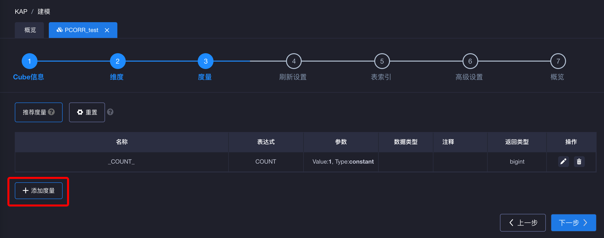
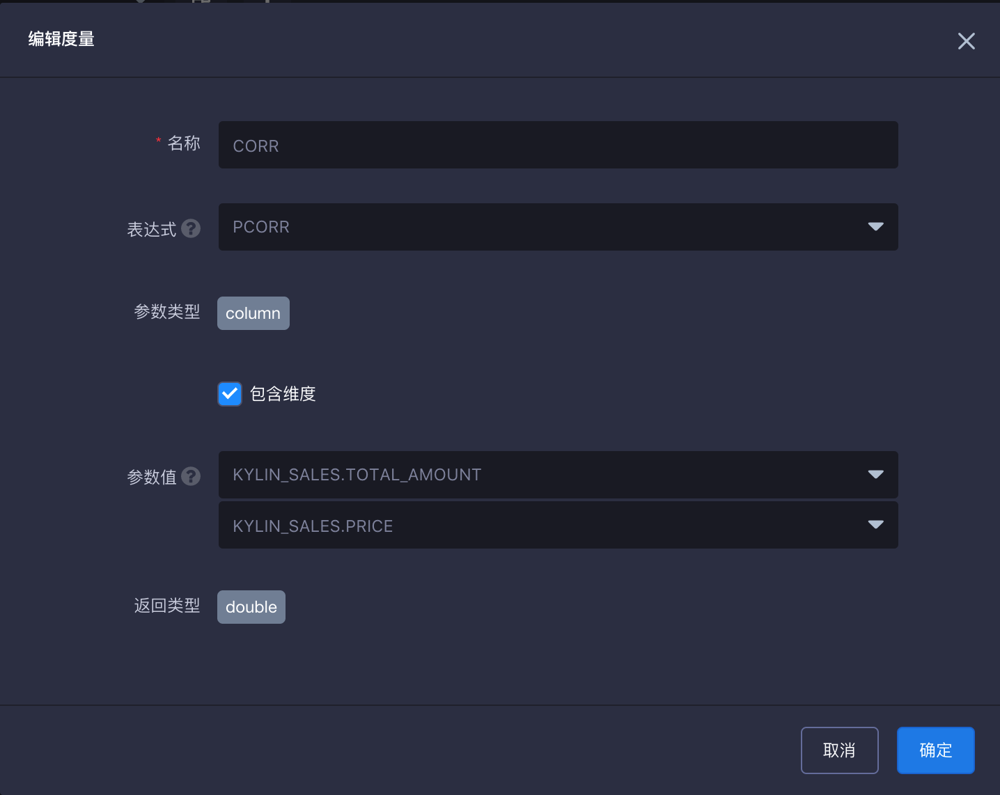
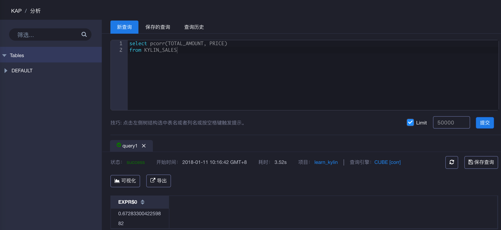

## CORR（Beta）查询 ##

相关性系数通常在统计中用于测量两个变量间的相关性强弱。在KAP V2.5.5版本中，KAP支持使用皮尔森相关系数函数，函数名为 pcorr。当前版本中，该函数暂时不支持下压查询，请您在使用前预先在Cube构建中进行相关设置。

### CORR 简介 ###

Corr 函数返回数值为衡量两个变量之间的线性关系。结果范围为 -1 至 +1（包括 -1 和 +1），其中 1 表示精确的正向线性关系，比如一个变量中的正向更改即表示另一个变量中对应量级的正向更改，0 表示变量之间没有线性关系，而 −1 表示精确的反向关系。

在KAP中使用的规则如下：

> pcorr({measure1},{measure2})，measure 为要查询的度量。其中需要注意的是，在当前版本中，查询的度量所支持的数据类型为：bigint，integer，int4，long8，tinyint，smallint，decimal。
>
> 请注意：如果其中一个度量的数据类型为decimal时，则另外一个度量的的数据类型也需要为decimal。其他数据类型组合则不受影响。

在 KAP 中查询示例如下：

```
SELECT pcorr(TOTAL_AMOUNT, PRICE)
FROM KYLIN_SALES
```

### 使用方法 ###

首先，在新建 Cube 界面，点击左下角**添加度量**来添加新的度量。



第二步，输入度量名称，选择 **CORR** 为表达式，选择度量。这里需要注意度量的**数据类型**应符合上文的使用规则。



第三步，设计并构建完 cube 后，转至**分析**页面进行如下查询。


