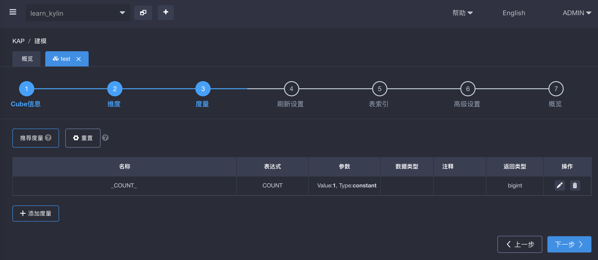
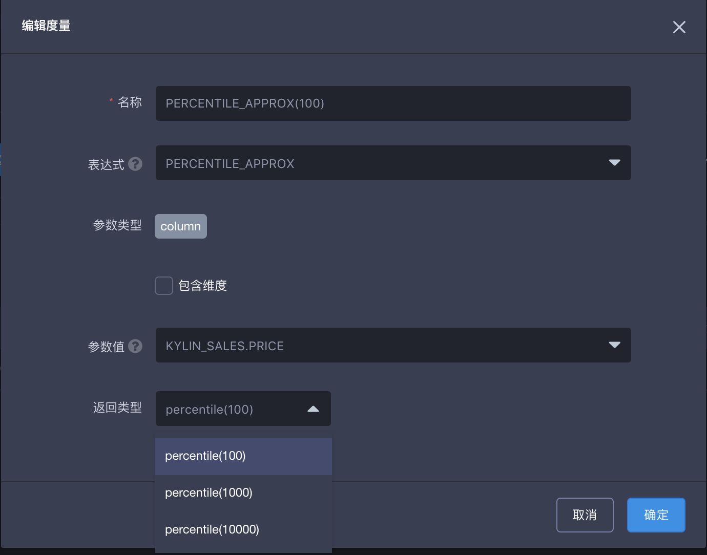
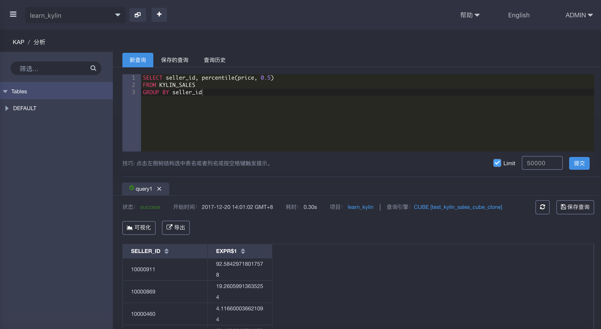

## percentile_approx 查询

KAP 支持 percentile 函数。在 KAP V2.5.4 以上的版本中，函数名称改为 percentile_approx，二者用法和效果相同。如果您预定义了百分比度量，则此类SQL查询可以实现亚秒级延迟。在 KAP 中，该函数提供三种返回类型： 'percentile(100)'、'percentile(1000)' 和 'percentile(10000)'，表示精确度逐步提升，同时占用的存储资源也越多。一般场景中，我们推荐您使用percentile(100)即可。

### percentile_approx简介

percentile_approx 函数返回数值的第 p 个百分位数的值，其语法如下：

> percentile_approx({measure},p,B)，measure 为要查询的度量，p 为 0 到 1 之间的百分比数字，包含 0 和 1，B 控制近似精度，B 越大，结果的精确度越高。percentile_approx 函数用插值法来确定第 p 个百分位数的值。
>

在 KAP 中查询示例如下：

```
SELECT seller_id, percentile_approx(price, 0.5)
FROM KYLIN_SALES
GROUP BY seller_id
```

### 使用方法

首先，在新建 Cube 界面，点击左下角**添加度量**来添加新的度量。



第二步，输入度量名称，选择 **PENCENTILE_APPROX** 为表达式，选择参数值，然后根据需要选择返回类型 'percentile(100)'、'percentile(1000)' 或 'percentile(10000)'。这里的返回类型即上述语法中的 B，值越大，结果的精确度越高。



第三步，设计并构建完 cube 后，转至**分析**页面进行查询。查询结果返回 SELLER ID 列中数据在第 50 个百分比的值。


