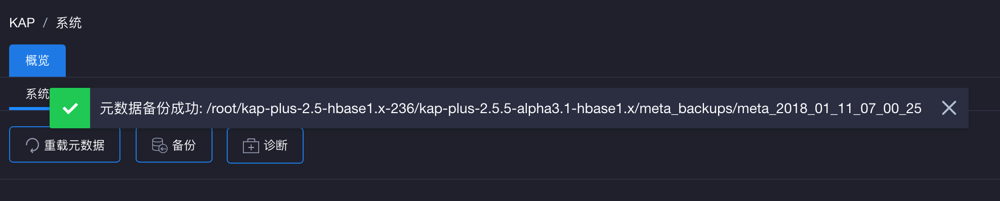
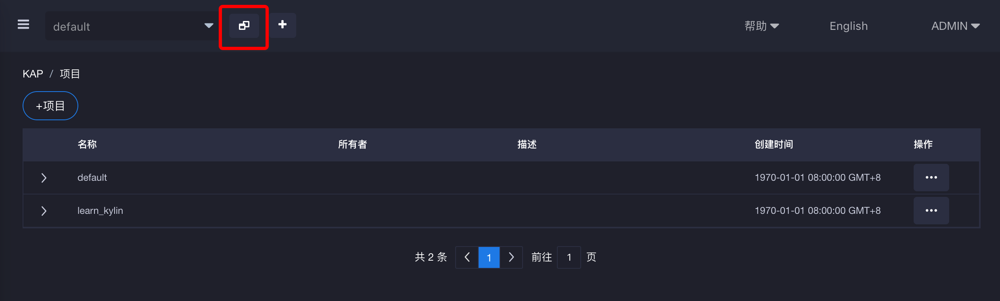
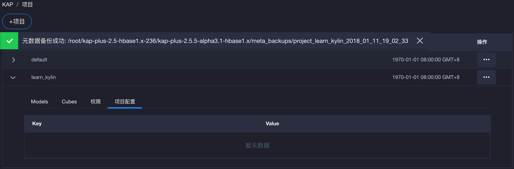
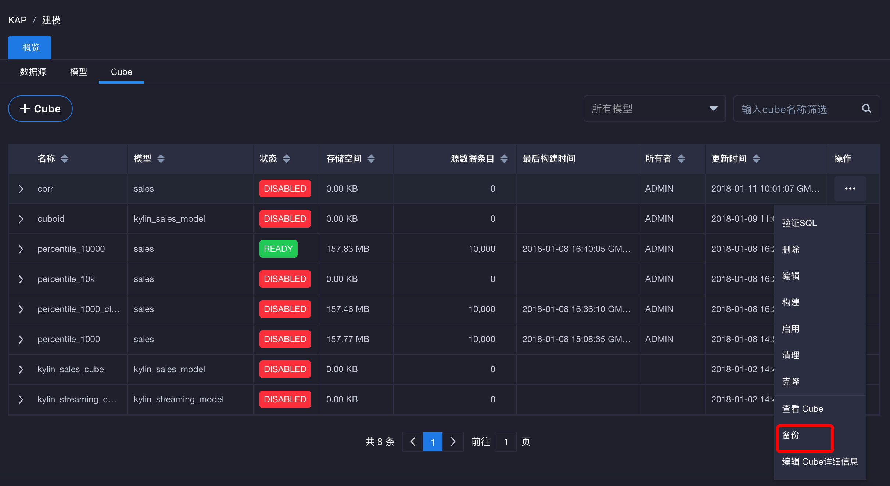
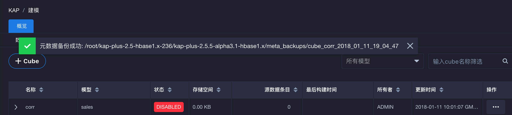

## 元数据备份

元数据是KAP中最重要的数据之一，备份元数据是运维工作中一个至关重要的环节。只有这样，在由于误操作导致整个KAP服务或某个Cube异常时，才能将KAP快速从备份中恢复出来。
一般的，在每次进行故障恢复或系统升级之前，对元数据进行备份是一个良好的习惯，这可以保证KAP服务在系统更新失败后依然有回滚的可能，在最坏情况下依然保持系统的鲁棒性。
KAP提供了一个工具用于备份KAP的元数据，具体用法是：

```shell
$KYLIN_HOME/bin/metastore.sh backup
```
当看到如下提示时即为备份成功：

```shell
metadata store backed up to /usr/local/kylin/meta_backups/meta_2016_06_10_20_24_50
```
在上面的例子里，这个命令会把KAP用到的所有元数据以文件形式下载到本地目录当中（如/usr/local/kylin/meta_backups/meta_2016_06_10_20_24_50）。目录结构如下表所示：

| 目录名             | 介绍                                 |
| :-------------- | :--------------------------------- |
| project         | 包含了项目的基本信息，项目所包含其它元数据类型的声明         |
| model_desc      | 包含了描述数据模型基本信息、结构的定义                |
| cube_desc       | 包含了描述Cube模型基本信息、结构的定义              |
| cube            | 包含了Cube实例的基本信息，以及下属Cube Segment的信息 |
| cube_statistics | 包含了Cube实例的统计信息包含了Cube实例的统计信息       |
| table           | 包含了表的基本信息，如Hive信息                  |
| table_exd       | 包含了表的扩展信息，如维度                      |
| table_snapshot  | 包含了Lookup表的镜像                      |
| dict            | 包含了使用字典列的字典                        |
| execute         | 包含了Cube构建任务的步骤信息                   |
| execute_output  | 包含了Cube构建任务的步骤输出                   |
进入到每个目录，可见json格式的元数据文件，例如：
```shell
ls -l /usr/local/kylin/meta_backups/meta_2016_06_10_20_24_50/cube
-rw-r--r--. 1 root root  2550 Sep 26 07:58 kylin_sales_cube.json
-rw-r--r--. 1 root root 16602 Sep 29 08:43 tweets_cube1.json

more kylin_sales_cube.json
{
  "uuid" : "2fbca32a-a33e-4b69-83dd-0bb8b1f8c53b",
  "last_modified" : 1474876733314,
  "version" : "1.6.0",
  "name" : "kylin_sales_cube",
  "owner" : null,
  "descriptor" : "kylin_sales_cube_desc",
  "cost" : 50,
  "status" : "READY",
  "segments" : [ {
    "uuid" : "99c77a86-fd1a-44cb-ac17-f469cc055484",
    "name" : "20120101000000_20160901000000",
    "storage_location_identifier" : "KYLIN_CEFC12LOOE",
    "date_range_start" : 1325376000000,
    "date_range_end" : 1472688000000,
    "source_offset_start" : 0,
    "source_offset_end" : 0,
    "status" : "READY",
    "size_kb" : 10870,
    ....
```

此外，元数据备份也是故障查找的一个工具，当系统出现故障导致前端频繁报错，通过该工具下载元数据并查看文件，往往能对确定元数据是否存在问题提供帮助。

### 用户界面下的元数据备份 ###

除了使用命令行进行元数据备份，KAP还支持在用户界面下进行元数据备份。

* **系统元数据保存**

进入页面左侧系统页面后，点击备份按钮进行系统元数据备份，元数据文件会备份在KAP安装目录下的meta_backups文件夹中（如图中的/root/kap-plus-2.5-hbase1.x-236/kap-plus-2.5.5-alpha3.1-hbase1.x/meta_backups）。文件命名为meta_当前备份时间（如meta_2018_01_11_07_00_25）。



* **项目元数据保存**

点击页面上方项目展开按键后，选择需要备份的项目点击操作按键后进行备份，项目元数据文件会备份在KAP安装目录下的meta_backups文件夹中。文件命名为project_备份项目名\_当前时间（如project_learn_kylin_2018_01_11_19_02_23）。





* **Cube元数据保存**

点击页面左侧建模按键后，选择Cube界面，选择需要备份的Cube点击操作按键后进行备份，Cube元数据文件会备份在KAP安装目录下的meta_backups文件夹中。文件命名为cube_备份Cube名\_当前时间（如cube_corr_2018_01_11_19_04_47）。




