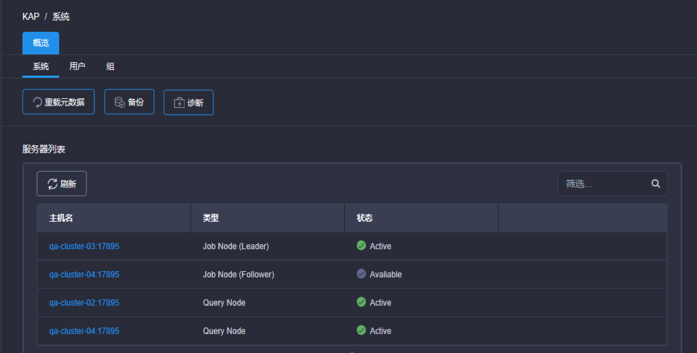

## 服务器状态 ##

在KAP V2.5.5版本中，用户可以在系统页面下的服务器列表看到所用服务器状态，如下图所示：

### 服务器类型 ###

* Job Node (Leader) ：当前充当任务引擎的节点。

* Job Node (Follower)： 若Leader节点出现故障负责接管其职能并继续跟踪当前任务及后续请求的节点。

* Query Node： 负责充当查询引擎的节点。

  更多相关信息可以查看手册中关于[任务引擎高可用](../installation/advancing_installation/advancing_installation_ha.cn.md)和 [负载均衡与集群部署](../installation/advancing_installation/advancing_installation_load_balance.cn.md)的部分。

### 服务器状态 ###

* Active: 当前节点正在运行。
* Available：当前Follower节点状态正常能够接替Leader节点。

若节点未连接则不会出现在服务器列表中。
