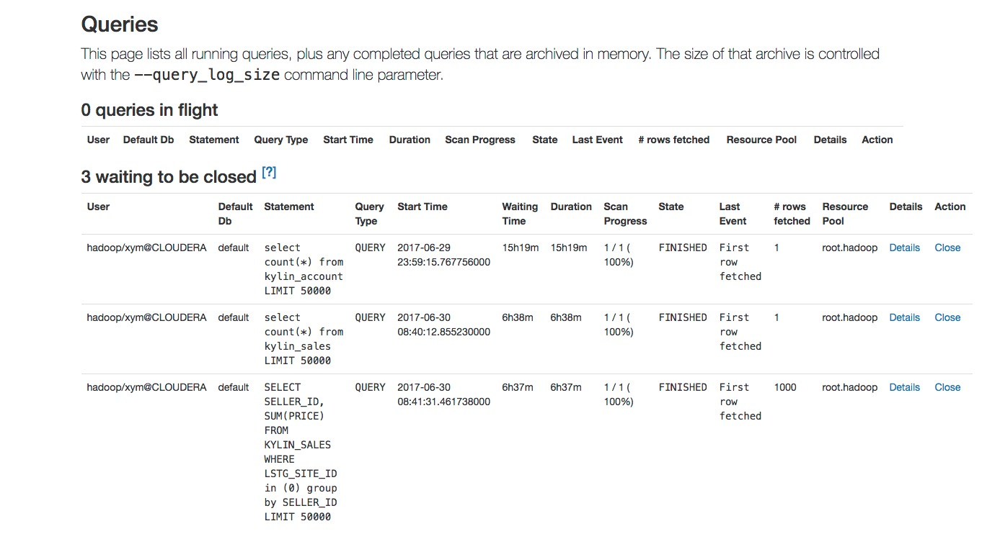

## 使用 Impala 查询引擎

  Impala 提高了 Apache Hadoop上的SQL查询性能，同时保留了熟悉的用户体验。 使用Impala，您可以实时查询数据，无论是存储在HDFS还是Apache HBase中，包括SELECT，JOIN 和聚合函数。 此外，Impala使用和hive相同的元数据，SQL语法（Hive SQL），ODBC驱动程序和用户界面（Hue Beeswax），为面向批量或实时查询提供了一个熟悉和统一的平台。 （由于这个原因，Hive用户可以利用Impala几乎没有设置开销。）

## Query Pushdown 连接 Impala
* impala使用HIVE JDBC接口，支持jdbc接口的应用可以通过Hive-jdbc访问Impala进行数据查询。

* Download HIVE JDBC Driver
  1. 根据自己 hadoop 集群 hive 的版本下载对应版本的[hive-jdbc-version.jar](hive-jdbc.jarhttps://mvnrepository.com/artifact/org.apache.hive/hive-jdbc)，请确保使用的 jdbc 版本不要高于集群的hive版本。
  2. 下载[httpclient-version.jar](https://mvnrepository.com/artifact/org.apache.httpcomponents/httpclient)和[httpcore-version.jar](https://mvnrepository.com/artifact/org.apache.httpcomponents/httpcore)。

* 安装 JDBC
  1. 把下载好的jar包放到 `$KAP_HOME/ext` 下面，以便让KAP在启动时可以加载 JDBC Driver 。

* 修改 `$KAP_HOME/conf/kylin.properties` ，添加以下配置：

  1. 配置 HIVE JDBC driver 和 Pushdown Runner:

     1. ```kylin.query.pushdown.runner-class-name=org.apache.kylin.query.adhoc.PushDownRunnerJdbcImpl```

     2. ```kylin.query.pushdown.jdbc.driver=org.apache.hive.jdbc.HiveDriver```


  2. 配置 JDBC URL

     1. 访问没有 kerberos 安全认证的 impala 集群，例如(访问default库):

        ```kylin.query.pushdown.jdbc.url=jdbc:hive2://impala_host:impala_hs2_port/default;auth=noSasl```

     2. 访问带有 kerberos 安全认证的 impala
       + 访问带有kerberos认证的impala集群需要JDBC Client端包含 impala(principal=<Impala-Kerberos-Principal>)principal 在 jdbc url 中，例如(访问 default 库)：

           ```kylin.query.pushdown.jdbc.url=jdbc:hive2://impala_host:impala_hs2_port/default;principal=Impala-Kerberos-Principal```


        + 请确保kap能都读取到的 hive-site.xml 中打开了hive-server2的kerberos 认证:
            ```
                   <property>
                       <name>hive.server2.authentication</name>
                       <value>kerberos</value>
                   </property>
             ```
        + 在初始 化hive-jdbc connection 前kap，需要具有有效的kerberos ticket，**请确保 klist 中存在有效的 principal** 能够访问 impala 集群。
  3. 验证 thriftserver
     1. 启动 beeline ```${SPARK_HOME} or ${HIVE_HOME}/bin/beeline```
     2. 使用 beeline 连接 Thrifterver ```!connect  kylin.query.pushdown.jdbc.url```
     3. 使用简单sql测试可用
  4. 验证 Query Pushdown
     1. 启动 kap ，进行表查询。
     2. 在 impala web 页面中能够找到刚才的查询，表示 kap 能够正常连接 impala。

      


