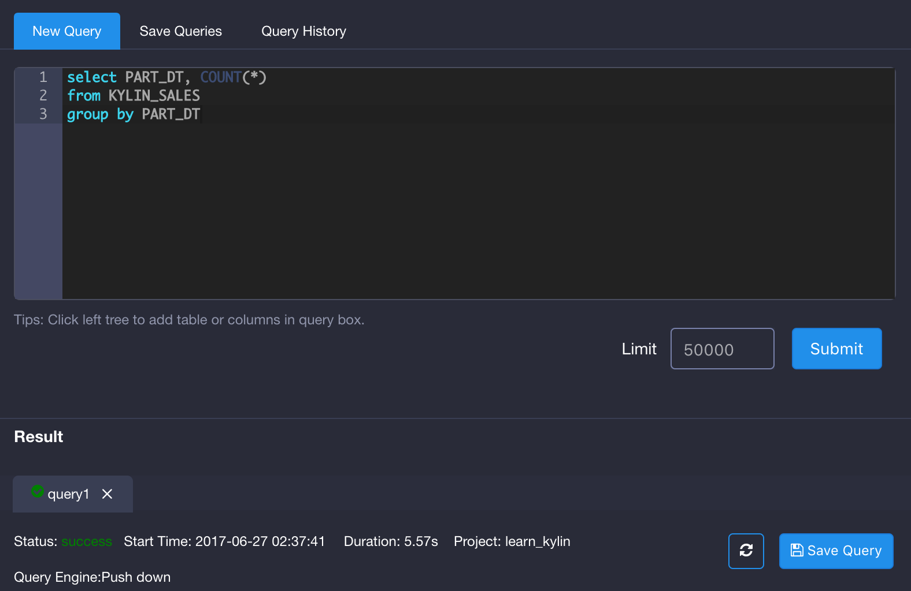

## 开启 Query Pushdown
即席查询功能默认未开启。如果用户需要开启即席查询，需要在`kylin.properties`文件中删去`kylin.query.pushdown.runner-class-name=io.kyligence.kap.storage.parquet.adhoc.PushDownRunnerSparkImpl`这一配置项前的注释符号使其生效。即席查询开启后，当Cube无法返回所需的查询结果时，默认将被重定向至Spark SQL。用户也可以手动配置，选择Hive作为重定向的对象。更多配置请参考[Kylin配置参数](../config/basic_settings.cn.md)。

开启即席查询后，所有同步的数据表将对用户可见，而无需构建相应的Cube。用户在提交查询时，若即席查询发挥作用，则状态下方的查询引擎条目里，会显示Pushdown。

